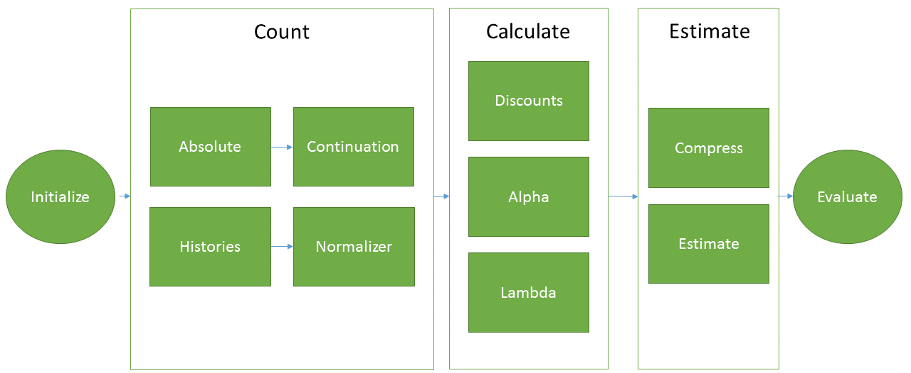
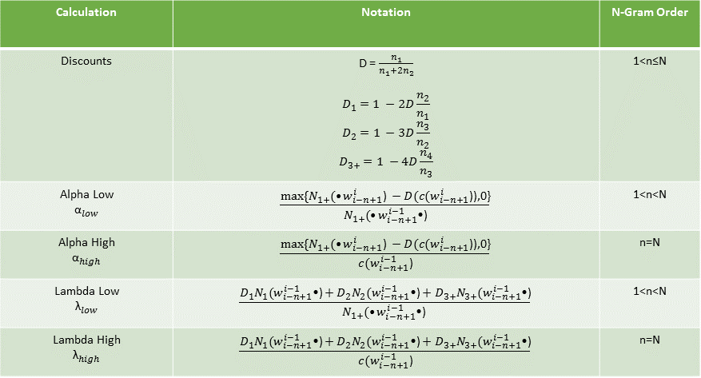
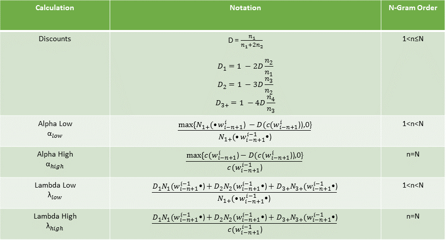
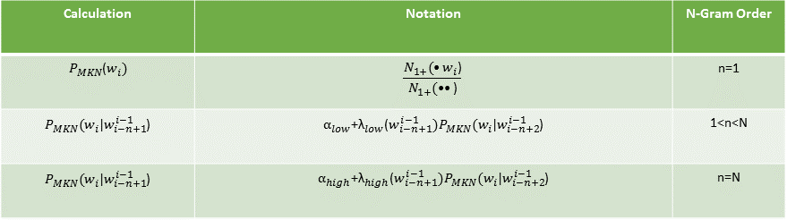

# Experimental Methods
The following experiments were designed to address four research questions. First, what is the affect of training set size on probabilistic language model prediction accuracy, size and runtime.  Second, to what degree does the incorporation of syntactic information improve predictive accuracy of probabilistic language models.  Third, how does the integration of semantic knowledge affect probabilistic language model prediction performance.  Lastly, how is prediction accuracy affected by linearly interpolating the probabilistic, syntactic and semantic models.  

This section serves three purposes. (1) Outline the materials, hardware and software environment, toolsets and natural language processing packages used during the project. (2) Briefly establish the degree to which the corpus used on this project adequately represents the situational parameters, and therefore the linguistic features and lexical variation of the language encountered within a mobile texting context, and (3), Clearly outline the project's seven-stage experimental methodology: (1) data acquisition, (2) data cleaning, (3) data sampling, (4), data analysis, (5) data processing, (6), predictive modeling, and (7) model evaluation. Models were evaluated intrinsically using the perplexity metric. The model with the lowest perplexity, given its size and runtime would be implemented as a shiny-based data product.

## Materials
### Software Environment
The project was implemented on a Windows x64-based laptop powered by an Intel Core i7-3610QM CPU @ 2.30GHz, 2301 MHz processor with 4 Cores, 8 Logical Processors, and 16.0 GB of installed memory, running the Microsoft Windows 10 Home operating system, version	10.0.14393 Build 14393. The scripts were authored using the 64 bit version of the R Programming Language, version 3.3.1. [@TheRFoundation2015] within R. Studio Version 0.99.903 [@RStudioTeam2016] development environment. The complete list of R packages used can be found in Appendix B.  The data.table package [@Dowle] for R was used as the data base for language modeling.

### Natural Language Processing Software  
Several Natural Language Processing (NLP) software packages provided essential functionality throughout the analysis, modeling, experimentation, and evaluation phases of the project. The quanteda package, version 0.9.9-3 [@Benoit2016b], provided tokenization, and feature counting and analysis functionality. Part-of-speech (POS) tagging was provided by the openNLP package package, version 1.5.3 [@Kottmann2016]. Lastly, the lsa package [Wild2015] delivered the latent semantic analysis functionality.  Zipf analyses were conducted using the ZipfR package [@StefanEvert2015].

Source code is available and can be forked from https://github.com/j2scode/PredictifyR.

## Corpus
The corpus used for this project was obtained from the HC Corpora website, a collection of freely available texts comprised of over 2.5 billion words from 67 languages [@Christensen2016]. The English language corpus, consisting of approximately 70 million words across three registers: news, blogs, and twitter feeds, was used for this project. The descriptive statistics are as follows:

`r figr("rawCorpusSummary-M", TRUE, type="Table")`: Raw Corpus Descriptive Statistics
```{r rawCorpusSummary-M, echo=F, eval=T, message=F, warning=F, cache=F, results='asis'}
rawCorpusSummary <- plotCorpusSummary(rawDataAnalysis)
kable(rawCorpusSummary, digits = 2, format.args = list(big.mark = ','))
```

The following priori qualitative analysis establishes the author's reasons for accepting the corpus as qualitatively representative of the situations, linguistic features, and lexical variation to be encountered in a mobile word prediction context. 

### Blogs Register 
The blogs register, comprised of `r rawDataAnalysis$featureMatrix$sentences[1]` sentences, `r rawDataAnalysis$featureMatrix$words[1]` words, and `r rawDataAnalysis$featureMatrix$wordTypes[1]` types, covered a range of topics to a diverse, unenumerated public audience. Interaction ranged from minimal to extensive, the size of the audience, and the nature of the content. Based upon available research, the blogger was likely 21-to-35 years of age, as this group accounted for some 53% of the total blogger population, followed by the 21 and less age group which constituted some 20% of the blogger population [@Kennon2015]. Content ranged from factual to imaginative, and served to persuade, inform, entertain, instruct, explain, share opinions, and raise one's social / professional profile. This register would be characterized by a wide continuum of formal and informal text, low to moderate use of slang, and a greater dispersion of lexical variety among the samples. Language models may have to accommodate liberal use of common internet or specialized content abbreviations. 

### News Register
The smallest of the registers, the online news content contained some `r rawDataAnalysis$featureMatrix$sentences[2]` sentences, `r rawDataAnalysis$featureMatrix$words[2]` words, and `r rawDataAnalysis$featureMatrix$wordTypes[2]` word types, Likely produced in institutional or business settings, the news content could be characterized as factual, informative, opinion-based, and with the exception of public opinion pages, non-interactive. Addressed to an unenumerated public, the news register would be characterized by greater formality, the use of standard English, few idioms and slang expressions, and relatively high degree of lexical diversity. Statistical language models that capture the lexical diversity of the population are likely to perform well, as should topic-based or semantic language models. 

### Twitter Register 
The twitter register, comprised of so-called "tweets" - text messages of 140 characters or less, were produced in largely personal-private settings on computers and on mobile phones. The addressees included the enumerated network of "friends", the enumerated members of groups to which the "tweeter" was subscribed, and, since messages could be "retweeted", the unenumerated public. According to Duggan (2015), 23% of internet users used twitter in 2015, the 18-29 age group represented the most prolific user group, followed by the 30-49 age group. Thirty-two percent of internet users age 18-29 (40% of all twitter users) and 29% of those age 30-49 (36% of all twitter users), used twitter [@Duggan2015]. Consisting of some `r rawDataAnalysis$featureMatrix$sentences[3]` sentences, `r rawDataAnalysis$featureMatrix$words[3]` words, and `r rawDataAnalysis$featureMatrix$wordTypes[3]` types, tweets tended to be opinion oriented with occasional supporting facts and served a range of purposes. Meeting new people from various backgrounds and locations, establishing and maintaining connections with others, grow friendships, and raising one's social media profile are among the many purposes of the tweet. Twitter content was likely to be characterized by informality, greater use of idioms and slang, non-standard spelling, and a lower degree of lexical richness.

Combined, these registers reflect the situational and therefore, linguistic diversity representative of the population of content for which word prediction functionality would be used.

### Reference Data
In addition, supporting reference data used in this project included a list of commonly used English language contractions [@Wikipedia2016], a list of profane words courtesy of Google's What Do You Love Project [@Google2012], a file containing common internet and text messaging abbreviations was obtained from Wiktionary [@Wiktionary2016] and a collection of emoticons was similarly compiled from Internet sources [@Cool-Smileys2010]. Each source was manually sanitized, and conditioned to eliminate ambiguity, profanity, and conflicts. All reference files are freely available as csv files and can be downloaded from the data/referenceData subdirectory at https://github.com/j2scode/PredictifyR. 

## Data Acquisition
The corpus was downloaded from the HC Corpora website [@Christensen2016], reshaped into sentences the raw corpus was organized by line, some having multiple sentences), and audited for data quality issues.  The following summary `r figr("rawCorpusAudit-M", TRUE, type="Table")` reveals several anomalies that were addressed during the data cleaning process.

`r figr("rawCorpusAudit-M", TRUE, type="Table")`: Raw Corpus Audit
```{r rawCorpusAudit-M, echo=F, eval=T, message=F, warning=F, cache=F}
audit <- plotCorpusAudit(rawDataAnalysis) 
kable(audit, digits = 2, format.args = list(big.mark = ','))
```

## Data Cleaning
The corpus contained some `r round(rawDataAnalysis$featureMatrix$tokens[4], -3)` tokens, of which approximately `r round(rawDataAnalysis$featureMatrix$words[4] / rawDataAnalysis$featureMatrix$tokens[4] * 100, 0)` % were words. Special characters (about `r round(audit$'% Special'[4], 0)` % of the corpus), punctuation, symbols and digital characters made up the rest. An inspection of words exceeding 40 characters in length revealed repeated string patterns, urls, email addresses, and various anomalies that could be eliminated in preprocessing. Somewhat surprisingly, contractions, common abbreviations and profanity made up less than `r round(sum(audit$'% Misspellings'[4],audit$'% Contractions'[4],audit$'% Abbreviations'[4], audit$'% Profanity'[4],0.5), digits = 0)` % of the corpus.  

During the cleaning process, the raw data were reshaped into sentences using the quanteda package [@Benoit2016b] and converted to lower case. Non UTF-8 encoding was corrected and special, control, non-printable, and non-ASCII characters were removed. Approximately 230 common misspellings, contractions, and abbreviations, were normalized. Email addresses, urls, and twitter hashtags were excised from the text. Hyphenated words were split and digits, symbols and punctuation (with the exception of the apostrophe not surrounded by whitespace, periods, exclamation points, and question marks) were extracted. Lastly, profanity and words exceeding 40 characters in length were eliminated. Stop words, made up largely of function words, were retained. Due to the size of the corpus and the processing speeds of available spell checkers, automated spell checking and correction were not performed.

The clean corpus descriptive statistics are as follows.

`r figr("cleanCorpusSummary-M", TRUE, type="Table")`: Clean Corpus Descriptive Statistics
```{r cleanCorpusSummary-M, echo=F, eval=T, message=F, warning=F, cache=F}
audit <- plotCorpusSummary(cleanDataAnalysis) 
kable(audit, digits = 2, format.args = list(big.mark = ','))
```

Weighing in at about `r audit$Size[4]` Mb, the corpus contains a vocabulary of `r audit$Types[4]` words. An N-gram language model based upon this corpus with $V^2$ = `r audit$Types[4]^2` bigrams and  $V^3$ = `r audit$Types[4]^3` trigrams, would approach memory capacity, especially for a mobile device.  The following section outlines the design process for a compact, yet representative corpora.

## Data Sampling
An intrinsic evaluation of any language model requires a training corpus, a separate development test set, and an unseen test set for final model evaluation. Typically, 80% of the data are designated for training, 10% for development and 10% for testing. However, training on a large corpus such as the HC Corpora with a vocabulary $V$ of some `r rawDataAnalysis$featureMatrix$wordTypes[4]` can present some practical and performance problems. Chiefly, the N-gram probability matrices can be unwieldy, exceedingly sparse, and computationally expensive. There would be $V^2$ = `r rawDataAnalysis$featureMatrix$wordTypes[4] ** 2` possible bigrams and the number of possible trigrams would be $V^3$ = `r rawDataAnalysis$featureMatrix$wordTypes[4] ** 3`. A prediction model that could run on a mobile device must balance potentially lower test set perplexity (higher accuracy) with computational and response time performance considerations. As such, intelligent sampling from the master corpus must produce a language model corpus which maximizes representativeness and minimizes size.

Representativeness, in the context of this project, has a two part definition. First, the lexical resource should represent the range of **lexical diversity** in the HC Corpus.  That is, the number of out-of-vocabulary (OOV) words in the lexical resource should be below some established threshold. The target for this project was 95% coverage, or no more than 5% OOV *tokens*. Second, the lexical resource should represent the distribution of **linguistic features** or part-of-speech tags in the HC Corpus. 

Therefore, the aim at this stage was to identify a minimum size **pilot corpus** that was representative of the HC Corpus according to the above definition. Two analyses were undertaken to address the question of representativeness.  The lexical diversity analysis applied Zipf's law and word frequency distribution analysis to the problem of language coverage and lexical size.  The lexical feature analysis examined the distribution of lexical features to ascertain optimal sampling unit, register, and overall corpus size. Both estimates were analyzed and the most conservative estimate was accepted as the pilot corpus sampling strategy. Finally, the pilot corpus is sampled and its lexical diversity and features were analyzed vis-a-vis those of the HC Corpus to confirm that, indeed the pilot corpus was representative.

### Lexical Diversity Analysis
Here, Zipf's law and word frequency distribution analysis revealed an estimate of optimal lexical size given the coverage target. This section includes a review of Zipf's law, an overview of how it is used to estimate lexical size, an evaluation of good-of-fit, a summary of the Zipf-Mandelbrot model, and the lexical size estimate.  

#### Zipf's Law
Popularized by American linguist, George Kingsley Zipf, Zipf's law explains one of the most basic, yet puzzling aspects of human language: words occur according to a mathematically simple, yet systematic frequency distribution whereby few very high frequency words account for most of the tokens in text. This strikingly simple distribution follows a power law known as Zipf's law, which states that the $r$th most frequent word has a frequency $f$(r) that scales according to
$$f(r)\propto{\frac{1}{r^{\alpha}}}$$
where $\alpha\approx1$ [@Zipf1935]. Roughly speaking, the frequency by which a word occurs is inversely proportional to its rank such that the $nth$ most common frequency will occur with a frequency $1/n$ that of the highest frequency word. So, the second most common word in a natural corpus will occur $1/2$ as much as the most common and the third most common word will occur $1/3$ as often as the most frequent, and so on. This word frequency distribution is commonly referred to as a "Zipfian"" distribution.

Assuming a corpus word frequency distribution models a Zipfian distribution, these characteristics can be used to define optimal properties such as corpus sample and lexical sizes. In fact, it can be shown that a high degree of vocabulary coverage can be achieved with a relatively small sampling of a corpus. To illustrate, the following frequency spectrum for the blogs register summarizes the word frequency distribution in terms of number of types ($Vm$) per frequency class ($m$). It reports how many distinct types occur once, twice, etc...

```{r blogSPCPlot-M, echo=F, message=FALSE, fig.height = 5, results='asis'}
spcPlot <- plotSPC(zipf[[1]]$docSpc)
grid.arrange(spcPlot$bar, spcPlot$tbl, nrow = 1)
```
`r figr("blogSPCPlot-M", TRUE, type="Figure")`: Frequency spectrum for blogs register

#### Applying Zipf's Law to Lexical Size Problem
Two additional columns have been added, $V$, the cumulative vocabulary size and $N$, the cumulative number of words by frequency class.
To determine the number of types required to achieve 95% coverage, take $N=$ `r zipfR::N(zipf[[1]]$docSpc)`, the number of words in the blogs register and $V=$ `r zipfR::V(zipf[[1]]$docSpc)` the blogs register vocabulary size. The corresponding OOV rate of 5% equates to $Noov=$ `r round(zipfR::N(zipf[[1]]$docSpc) * .05, 0)` words. According to the frequency spectrum, the OOV rate is reached within the top `r spcPlot$oov$m` frequency classes. Subtracting the corresponding $Voov=$ `r spcPlot$oov$V` from total vocabulary size $V=$ `r zipfR::V(zipf[[1]]$docSpc)` yields `r zipfR::V(zipf[[1]]$docSpc) - spcPlot$oov$V`, the number of types that the lexical resource must include in order to achieve 95% token coverage. The corresponding number of tokens can be obtained from a vocabulary growth curve, which relates vocabulary size with the number of word tokens.  

The next step in the analysis was to ascertain the degree to which Zipfs law, in its classic form, could be applied as above to determine optimal lexical size.

#### Zipfian Distribution Goodness-of-Fit
The Zipf Plot, which relates log rank to log frequency, provides a good visual indicator of goodness-of-fit. The data conform to Zipf’s law to the extent that the plot is linear. The following plots graphically characterize goodness-of-fit for each register.

```{r blogsZipfPlot-M, echo=F, fig.width=3.1, fig.height=3, message=FALSE, results='asis', cache=T, out.extra='style="float:left"'}
zPlot <- plotZipf(zipf[[1]]$docTfl, register = 'Blogs', color = 'orangered3')
zPlot$zipf
blogResiduals <- zPlot$residuals
```
```{r newsZipfPlot-M, echo=F, fig.width=3.1, fig.height=3, message=FALSE, results='asis', cache=T, out.extra='style="float:left"'}
zPlot <- plotZipf(zipf[[2]]$docTfl, register = 'News', color = 'navyblue')
zPlot$zipf
newsResiduals <- zPlot$residuals
```

```{r twitterZipfPlot-M, echo=F, fig.width=3.1, fig.height=3, message=FALSE, results='asis', cache=T, out.extra='style="float:left"'}
zPlot <- plotZipf(zipf[[3]]$docTfl, register = 'Twitter', color = 'springgreen4')
zPlot$zipf
twitterResiduals <- zPlot$residuals
```
`r figr("zipfPlots-M", TRUE, type="Figure")`: Zipfian Distribution Goodness of Fit

The curvilinear line shapes indicate systematic variation from a Zipfian distribution. The following residual plots confirm problems with goodness-of-fit.

```{r blogsZipfResiduals-M, echo=F, fig.width=3.1, fig.height=3, message=FALSE, results='asis', cache=T, out.extra='style="float:left"'}
blogResiduals
```
```{r newsZipfResiduals-M, echo=F, fig.width=3.1, fig.height=3, message=FALSE, results='asis', cache=T, out.extra='style="float:left"'}
newsResiduals
```
```{r twitterZipfResiduals-M, echo=F, fig.width=3.1, fig.height=3, message=FALSE, results='asis', cache=T, out.extra='style="float:left"'}
twitterResiduals
```
`r figr("zipfResiduals", TRUE, type="Figure")`: Zipf Residual Plots

This result was not surprising. In a large scale analysis of over 30,000 texts in the Project Gutenberg database  [@Moreno-Sanchez2016], goodness of fit tests showed that only 15% of the texts were compatible with this form of Zipf's law. The reason is that the language is creative, evolving, and characterized by a very large, perhaps infinite number of type probabilities and word frequency distributions are characterized by a large number of low probability events [@Khmaladze1988]. Such distributions, referred to as LNRE (large number of rare event) distributions, contain rare events that occur in the population that do not occur in the sample, regardless of its size. Since the joint probability of unseen events in the sample sum up to 1, it must be adjusted to in order to free probability space for the unseen types [@R.H.Baayen2008]. Fortunately, LNRE models have been developed to adjust for the large probability of unseen events. 

#### Zipf-Mandelbrot Model
One such LNRE model is based upon the following generalization of Zipf's law proposed by Benoit Mandelbrot [@Mandelbrot61].

$$f(r) = \frac{1}{(r+\beta)^\alpha}$$
By "shifting" the rank by an amount β, the Zipf-Mandelbrot (ZM) formulation more closely fits the frequency distribution in language [@Zipf:36; Zipf49; Mandelbrot1953; Mandelbrot61]. Using the zipfR package [@StefanEvert2015], ZM models were independently fit against each register of the corpus. Parameters $\alpha$ and $\beta$ were estimated as follows:

`r figr("zmParams-M", TRUE, type="Table")`: Zipf-Mandelbrot Model Parameters by Register
```{r zmParams, echo=F, message=FALSE, results='asis', cache=T}
zmParams <- plotZMParameters(zipf)
kable(zmParams, digits = 4, format.args = list(big.mark = ','))
```

**Frequency Spectra**
Frequency spectra are the essential data structures used to estimate the required lexical vocabulary size to meet a language coverage target. Expected frequency spectra were estimated using the ZM model and are juxtaposed against the observed word frequency distributions from the corpus. 

```{r blogsSpectra-M, echo=F, fig.width=3.1, fig.height=3, message=FALSE, results='asis', cache=T, out.extra='style="float:left"'}
plot(zipf[[1]]$docSpc, zipf[[1]]$docLnre$spc, legend = c("Observed", "ZM"), main = 'Blog Frequency Spectrum')
```
```{r newsSpectra-M, echo=F, fig.width=3.1, fig.height=3, message=FALSE, results='asis', cache=T, out.extra='style="float:left"'}
plot(zipf[[2]]$docSpc, zipf[[2]]$docLnre$spc, legend = c("Observed", "ZM"), main = 'News Frequency Spectrum')
```
```{r twitterSpectra-M, echo=F, fig.width=3.1, fig.height=3, message=FALSE, results='asis', cache=T, out.extra='style="float:left"'}
plot(zipf[[3]]$docSpc, zipf[[3]]$docLnre$spc, legend = c("Observed", "ZM"), main = 'Twitter Frequency Spectrum')
```
`r figr("spectra", TRUE, type="Figure")`: Zipf-Mandelbrot Expected vs. Observed Frequency Spectra

The observed and expected frequency spectra appear to fit very well. Next, the observed (smoothed) and extrapolated vocabulary growth curves are evaluated for fit.

**Vocabulary Growth Curves**
Vocabulary growth curves (VGCs) relate vocabulary size $V$ to sample size $N$. Expected VGCs were extrapolated using the ZM model from observed VGCs and are plotted vis-a-vis smoother (interpolated) observed VGCs.

```{r blogsVGC-M, echo=F, message=FALSE, results='asis', cache=T}
plot(zipf[[1]]$docIntVgc, zipf[[1]]$docExtVgc, legend = c("Observed", "ZM"), main = 'Blog Vocabulary Growth Curve')  
```
`r figr("blogsVGC-M", TRUE, type="Figure")`: Zipf-Mandelbrot Expected vs. Observed Vocabulary Growth Curves (Blogs)

```{r newsVGC, echo=F, message=FALSE, results='asis', cache=T}
plot(zipf[[2]]$docIntVgc, zipf[[2]]$docExtVgc, legend = c("Observed", "ZM"), main = 'News Vocabulary Growth Curve')  
```
`r figr("newsVGC-M", TRUE, type="Figure")`: Zipf-Mandelbrot Expected vs. Observed Vocabulary Growth Curves (News)

```{r twitterVGC-M, echo=F, message=FALSE, results='asis', cache=T}
plot(zipf[[3]]$docIntVgc, zipf[[3]]$docExtVgc, legend = c("Observed", "ZM"), main = 'Twitter Vocabulary Growth Curve') 
```
`r figr("twitterVGC-M", TRUE, type="Figure")`: Zipf-Mandelbrot Expected vs. Observed Vocabulary Growth Curves (Twitter)

Both spectra and vocabulary growth curves fit the data reasonably well. Now, the lexical size can be estimated.

#### Lexical Size Estimate
The lexical size estimates were obtained by comparing observed vocabulary sizes $V$ of corpus registers at various sample sizes, with the ZM model derived expected vocabulary $EV$ of the HC Corpus registers. Using the ZipfR package [@StefanEvert2015], frequency spectra were created for each register at varying sample sizes. Based upon these observed spectra, ZM models were trained and an expected vocabulary $EV$ size for the full corpus register was estimated. Out-of-vocabulary word types $Voov$ were calculated by subtracting the observed vocabulary $V$ from the ZM model expected vocabulary $EV$.  Utilizing the ZM model derived frequency spectrum, the associated numbers of out-of-vocabulary tokens $Noov$ were determined by cumulatively summing the product of the frequency classes $m$ and the vocabulary $Vm$, until $Voov$ was reached. The out-of-vocabulary rate (OOV Rate) was obtained by dividing $Noov$ by the number of tokens in the HC Corpus register.  The coverage rates at various sample sizes are summarized below.

```{r coveragePlot-M, echo=F, message=FALSE,  eval=T, results='asis'}
coveragePlots <- plotCoverage(estimates)
coveragePlots$plot
```
`r figr("coveragePlot-M", TRUE, type="Figure")`: Lexical coverage by sample size

Two observations stood out. First, a high degree of lexical coverage could be obtained with relatively small samples from the HC Corpora. Second, the required sample size grows dramatically with increased coverage.  On average, a one point increase in coverage required `r round(sum(estimates$analysis$size) / sum(estimates$analysis$coverage), 0)` additional tokens to be added to the lexicon. Notwithstanding, the coverage target of 95% was increased slightly given the general tendency of LNRE models to underestimate vocabulary sizes in extrapolation [@Evert2005a]. The following summarizes the lexical diversity-based sample size estimates

`r figr("sampleSizes-M", TRUE, type="Table")`: Lexical diversity-based sample size estimate
```{r sampleSizes, echo=F, message=FALSE, results='asis', cache=T}
kable(coveragePlots$tbl, digits = 0, format.args = list(big.mark = ','))
```

The analysis shows that, an average `r round(mean(estimates$sampleSize$coverage), 0)`% coverage rate could be achieved with a lexicon of `r sum(estimates$sampleSize$size)` tokens, `r round(sum(estimates$sampleSize$size) / cleanDataAnalysis$featureMatrix$tokens[4] * 100, 0)` percent of the size of the HC Corpus. 

Next, the distribution of lexical features will be examined vis-a-vis the sample size estimation problem.

### Lexical Feature Analysis
Corpus representativeness, [@Biber1993] argues, also depends upon "the extent to which it contains the range of linguistic distributions in the population". Thusly,this analysis examines the distribution of lexical features vis-a-vis optimal lexical size in terms of the size of the sampling unit, the number of sampling units in the overall lexical resource as well as the stratified representation of each register within the corpus. To capture the corpus' linguistic nuances, the following `r nrow(subset(posTags, Study == TRUE))` lexical features commonly used in variation studies were studied:

`r figr("features-M", TRUE, type="Table")`: Descriptive Statistics for frequency scores (per `r samplingUnit[[length(samplingUnit)]]$size` words)

```{r features-M, echo=F, message=FALSE, results='asis', cache=F}
lf <- as.data.frame(corpusSize$analysis)
names(lf) <- c('Tag', 'Description', 'Mean', 'Max', 'Mean', 'Range', 'Total', '% Total',
               'SD','Variation Coefficient', 'Tolerable Error', 'Sample Size')
kable(lf, digits = 2, format.args = list(big.mark = ','))
```

Prepositions, nouns, and verbs were not only the most frequent per `r samplingUnit$size` words, but had the greatest range of variation among the samples, nouns being the most varied of the tags studied.  WH relative clauses were quite rare, accounting for less than `r round((subset(lf, Tag == 'WP', select = Total) / sum(lf$Total)) + 1, 0)`% of the parts-of-speech tags.

#### Sampling Unit
According to Biber (1993), each sampling unit should represent the range of linquistic characteristics in the text. To determine sampling unit size, the corpus was split into 50 pairs of 100, 500, 1000, and 2000 word texts. Chi-squared tests compared the distributions of the `r nrow(subset(posTags, Study == TRUE)) ` selected lexical features between the pairs of texts. If large differences were found between the two pairs of samples, the sample size did not adequately represent the overall linguistic characteristics of the text. `r figr("sua", TRUE, type="Figure")` summarizes the chi-Square p-values for distribution of lexical features between texts.

`r figr("sua-M", TRUE, type="Table")`: Chi-Square p-values for distribution of lexical features between texts
```{r sua-M, echo=F, message=FALSE,  eval=T, results='asis'}
kable(samplingUnit[[length(samplingUnit)]]$wide, digits = 4, format.args = list(big.mark = ','))
```

The average p-Value across all `r samplingUnit[[length(samplingUnit)]]$size`-word samples and POS tags was  `r round(samplingUnit[[length(samplingUnit)]]$mean,2)`. At the corpus level, the p-values were above $\alpha = 0.05$, indicating that the samples came from a similar distribution. Despite the dispersion of nouns, prepositions and verbs in the news register, indicating that a larger sampling unit might be necessary, the mean p-value across all tags was `r samplingUnit[[length(samplingUnit)]]$wide$mean[2]`.  Thus, the null hypothesis of similar distributions was not rejected and the sampling unit size of `r samplingUnit[[length(samplingUnit)]]$size` tokens would be the answer.

#### Total Corpus Size
Total corpus size is based upon the distribution characteristics of each linguistic feature. More precisely, there are $n_i$ different estimates of total corpus size, one for each of the $i$ lexical features.  Once a calculation is made for each feature $i$, the largest $n$ was selected as the estimate.  The corpus size estimate is thereby given by the following equation:
$$max(n_i) = \frac{s^2}{(\frac{te}{t})^2}$$
where $n_i$ is the computed sample size, in terms of contiguous sampling units, associated with the $i$th lexical feature, $s$ is the estimated standard deviation of the feature in the population, $te$ is the tolerable error (equal to 1/2 of the desired 95% confidence interval), $t$ is the $t$-value for the desired probability level (1.79588482 for $\alpha$ = 0.05 with 11 degrees of freedom) [@Biber1993]. 

The corpus sample size, in terms of `r samplingUnit[[length(samplingUnit)]]$size`-word samples (`r figr("features", TRUE, type="Table")`), is `r round(max(lf$'Sample Size'), digits = 0)`, or `r samplingUnit[[length(samplingUnit)]]$size * round(max(lf$'Sample Size'), digits = 0)` tokens. Rare lexical features (less than 5% of total) were not considered. Next, the proportional representation of each register is determined.  

#### Register Size
The sample size for each register comprised a base component - a minimum number of texts to be allocated to each register - plus a proportional component that was based upon the degree of variation in each register. The formula for calculating register sample size is:
$$n_r = (t\cdot b) + \lambda \cdot avc_r$$
where $r$ is the register, $t$ is total corpus size, `r round(max(lf$'Sample Size'), digits = 0)`, and $b = 0.1$, the base allocation or the fraction of the total corpus that each register was allocated. Lambda is:
$$\lambda = \frac{t - \displaystyle\sum_{i=1}^{r} t \cdot b}{\displaystyle\sum_{i=1}^{r} avc_r}$$
The numerator is the proportional allocation, total corpus size minus the base for each register.  The average variation coefficient $avc_r$ for each register is calculated as follows:
$$avc_r = \frac {1}{f} \cdot \displaystyle\sum_{i=1}^{f} \frac{sd_f}{\mu_f}$$
where $f$ is `r nrow(subset(posTags, Study == TRUE))`, the number of features studied, $sd_f$ is the standard of deviation for feature $f$, and $\mu_f$ is the mean distribution for feature $f$.  As such, the sample size allocated to each register is:

`r figr("registerSizeTable-M", TRUE, type="Table")`: Sample sizes for each register
```{r registerSizeTable-M, echo=F, message=FALSE,  eval=T, results='asis'}
kable(registerSize, digits = c(0,0,2,0,0,0,0,0), format.args = list(big.mark = ','))
```

### Pilot Corpus Sampling Strategy
The following summarizes the sample size estimates using the lexical diversity and lexical feature analyses.

`r figr("pilotAnalysis-M", TRUE, type="Table")`: Sample Size Estimate Analyses (Tokens)
```{r pilotAnalysis-M, echo=F, message=FALSE,  eval=T, results='asis'}
kable(pilotDesign$comparison, digits = 0, format.args = list(big.mark = ','))
```

Several observations are worth noting.  First, the lexical diversity-based estimate of `r pilotDesign$comparison[4,3]` tokens was significantly greater than that of the lexical feature analysis. The second notable observation was the vast difference in the proportional representation of the news register vis-a-vis that of the blog and twitter registers.  Given the lexical diversity of the news register, `r pilotDesign$comparison[2,7]`% of the news register was required to represent linguistic characteristics of the population of news content in the HC Corpus, versus `r pilotDesign$comparison[1,7]`% for the blog and twitter registers. Despite this, the news register accounted for just `r pilotDesign$comparison[2,8]`% of the pilot corpus. The blogs and twitter registers accounted for Some `r sum(pilotDesign$comparison[1,8], pilotDesign$comparison[3,8])`% of the pilot. The last, and somewhat surprising observation was that lexical diversity and density representation could be achieved with just `r pilotDesign$comparison[4,7]`% of the HC Corpus. 

Taking a conservative approach, the total and per-register pilot corpus sample sizes would come from the lexical diversity analysis. The sampling unit derived from the lexical feature analysis would be converted to sentences based upon average sentence length of each register. Lastly, to work with round numbers, the pilot corpus sample size was extrapolated out to 5%, while maintaining the proportional representation of each register. The following table outlines the extrapolated pilot corpus sample size assuming a `r samplingUnit[[length(samplingUnit)]]$size` token sampling unit as given by the lexical feature analysis.

`r figr("pilotDesign-M", TRUE, type="Table")`: Pilot corpus design
```{r pilotDesign-M, echo=F, message=FALSE,  eval=T, results='asis'}
kable(pilotDesign$pilot, digits = 0, format.args = list(big.mark = ','))
```

### Pilot Corpus Verification
In order to test whether the pilot corpus was truly representative, two tests were conducted. The first checked the number of OOV words in the pilot corpus.  More concretely, the number of words in the cleaned HC Corpus that were not in the pilot corpus was normalized by the HC Corpus vocabulary size to obtain an OOV Rate. Next, a comparison of the distribution of lexical features between the corpora was tested for similarity using a chi-squared test.  

#### Vocabulary Verification
The following table summarizes the vocabulary and token OOV rates for the pilot corpus.

`r figr("vocabularyVerification-M", TRUE, type="Table")`: Pilot corpus vocabulary OOV Rates
```{r vocabularyVerification-M, echo=F, message=FALSE,  eval=T, results='asis'}
kable(coverage, digits = c(0,0,0,0,2), format.args = list(big.mark = ','))
```

This analysis illustrates a feature of a "zipfian" distribution. Despite a vocabulary OOV rate of `r round(coverage[4,4] / coverage[4,2] * 100, 0)`% the pilot corpus covered `r round(coverage[4,8], 0)`% of the tokens in the HC Corpus.

#### Lexical Feature Verification
Chi-squared tests were conducted on the distributions of POS tags in the HC and pilot corpus. The hypothesis was that no statistically significant differences existed between the distributions of lexical features in the HC and pilot corpora.  This hypothesis was rejected if data showed a difference with a five percent or less probability. 

`r figr("featureVerification-M", TRUE, type="Table")`: Lexical Feature Distribution HC Corpora vis-a-vis Pilot Corpus (p-Value = `r features$pValue`)
```{r featureVerification-M, echo=F, message=FALSE,  eval=T, results='asis'}
kable(features$means, digits = 4, format.args = list(big.mark = ','))
```

The high p-Value indicated that there was a `r round(features$pValue * 100, 1)` percent chance that the differences were due to chance. Therefore, the hypothesis is not rejected and the Pilot Corpus represents the range of lexical variation of the HC Corpus.

Having established a representative pilot corpus, the training, validation, and test sets were designated as described in the next section.

### Data Sampling Strategy Summary
To sum up, two analyses were conducted in order to develop the smallest possible representative **pilot corpus**.  In the lexical diversity analysis, linear models based upon the Zipf Mandelbrot law provided sample sizes estimates based upon the distribution of word frequencies.  The lexical feature analysis determined sample size in terms of chunk size and number of chunks, for each register based upon the variation in the distributions of lexical features. Taking the larger of the two estimates for the pilot corpus, test were conducted to ensure that the pilot corpus was indeed representative of the HC Corpus. Coverage analysis showed that over 95% of the tokens in the HC Corpus could be obtained with `r round(sum(estimates$sampleSize$size) / cleanDataAnalysis$featureMatrix$tokens[4] * 100, 0)` percent of the HC Corpus. Chi-squared comparisons of the lexical feature distributions showed that the pilot corpus included the range and distribution of lexical features HC Corpus. 

## Data Splitting
The model corpora, consisting of four training sets, a validation set and a test set would be comprised of one or more pilot corpora. One pilot corpus was set aside for the validation set and another for the test set. The remaining data was split among four training sets: alpha, beta, gamma, and delta, which constituted approximately 10%, 20%, 35%, and 50% of the overall corpus size respectively. The design is summarized below.

`r figr("corporaDesign-M", TRUE, type="Table")`: Model Corpora Design
```{r corporaDesign-M, echo=F, message=FALSE,  eval=T, results='asis'}
kable(pilotDesign$corpusDesign, digits = 0, format.args = list(big.mark = ','))
```

## Data Exploration 
The qualitative and quantitative exploratory data analysis (EDA) summarized in this section was conducted on a pilot corpus as well as the four training sets. An examination of the pilot corpus provided a sense of the lexical and linguistic features, their distributions, n-grams and frequencies.  The training set evaluation focused on lexical coverage of the various training sets vis-a-vis the validation set.  

### Pilot Corpus EDA
#### Descriptive Statistics
The following table outlines the descriptive statistics for the training corpus.

`r figr("pilotStatistics-M", TRUE, type="Table")`: Pilot Corpus Descriptive Statistics
```{r pilotStatistics-M, echo=F, message=FALSE,  eval=T, results='asis'}
pilotStats <- plotCorpusSummary(pilotDataAnalysis)
kable(pilotStats, digits = 0, format.args = list(big.mark = ','))
```

Reducing the size of the corpus by `r round((cleanDataAnalysis$featureMatrix$tokens[4] - pilotDataAnalysis$featureMatrix$tokens[4]) / cleanDataAnalysis$featureMatrix$tokens[4] * 100, 0)`% while retaining the lexical diversity and feature distribution of the HC Corpus, was the **key finding** of this analysis.

#### Lexical Diversity Analysis
Lexical diversity, or richness, is a measure of the different words that are used in a text. Various measures of lexical richness: Yule’s K [@Yule1944a], the Zipf slope [@Zipf1935], the type-token ratio, Herdan’s C [@Herdan1960], Guiraud’s R [@Guiraud1954a], the mean log frequency [@Carroll1967], the Mean Segmental Type-Token Ratio [@Johnson1944a] and the vocabulary growth rate (the ratio of hapax legomena to tokens sampled) [@R.H.Baayen2008] were calculated and plotted cumulatively over samples from each register. Since the lexical diversity measures above are sensitive to sample size, the lexical diversity measures were computed on single samples of `r max(diversityAnalysis$measures[[1]]$Tokens)` tokens taken from each register.

```{r diversityPlots-M, echo=F, eval=T, message=F, warning=F, cache=F}
diversityPlots <- plotDiversityFigure(diversityAnalysis$measures)
do.call(grid.arrange, c(diversityPlots, ncol = 4, top = "Corpus Lexical Diversity Analysis"))
```
`r figr("diversityPlots-M", TRUE, type="Figure")`: Pilot Corpus Lexical Diversity Analysis

The curvilinear distribution of word types (upper left), shows that vocabulary growth is relatively stable within text segments, but the occurrences of new types decrease throughout the course of the text. The vocabulary growth rate is the probability of encountering an unseen type, after having read $N$ tokens, and is estimated by the ratio of the number of hapax legomena (types of frequency 1), to the number of tokens, $N$. The type token ratio decreased rapidly as the number of tokens read approached approximately 100,000 tokens, then decreased at a slower rate as the number of tokens read increased. The mean log frequency is the average frequency of all words that appear up to $N$ tokens read. Herdan's C is the ratio of the log of the vocabulary size $V$ and tokens $N$ [@Herdan1960]. Guiraud's R is the ratio of the vocabulary $V$ and the square root of the number of tokens $N$. Yule's K, often used for author attribution of literary texts, is a measure of lexical repetition that is independent of text size. Finally, Zipf's Slope [@Baayen2013] is Zipf's rank-frequency curve in the double-logarithmic space.


`r figr("diversityTable-M", TRUE, type="Table")`: Lexical Diversity Measures at $N$ = `r max(diversityAnalysis$measures[[1]]$Tokens)` tokens
```{r diversityTable-M, echo=F, eval=T, message=F, warning=F, cache=F}
diversityTable <- plotDiversityTable(diversityAnalysis$growth)
kable(diversityTable, digits = 2, format.args = list(big.mark = ','))
```

`r figr("diversityTable-M", TRUE, type="Table")` summarizes the relative lexical diversity measures for `r max(diversityAnalysis$measures[[1]]$Tokens)` tokens read from each register.

Consistent with the priori supposition, the news register appeared to have the greatest degree of lexical diversity across all measures; whereas, the twitter register had the least. They **key finding** is that the lexical diversity-based register sample size estimates were consistent with the register lexical diversity measures in this analysis. The greater the lexical diversity of a register, the greater the sampling proportion required to representative.

#### Lexical Density Analysis
Lexical density, the ratio of content words (nouns, adjectives, verbs, adverbs) to all words in a text, is an estimated measure of content within a text. While N-Gram models work well with function words, they tend to underperform in content word prediction.  Incorporating semantic information contained in content words can improve overall prediction accuracy.  Lexical density measures can indicate the degree to which semantic analysis can improve overall prediction accuracy.

`r figr("densityAnalysis-M", TRUE, type="Table")`: Lexical Density Analysis of Pilot Corpus
```{r densityAnalysis-M, echo=F, eval=T, message=F, warning=F, cache=F}
kable(densityAnalysis, digits = 1, format.args = list(big.mark = ','))
```

Overall density for the corpus was `r round(densityAnalysis$Density[4],0)`%, with the news register leading the group at `r round(max(densityAnalysis$Density),0)`%.  The blogs register, somewhat surprisingly, had the lowest percentage of content words. The **key finding**, in any case, was the seemingly low level of lexical density in the corpus. The potential impact of semantic analysis on prediction accuracy remained an open question at this stage of the analysis.

#### Lexical Feature Analysis
The following plot depicts the distribution of select lexical features commonly used in variation studies.
```{r trainLexicalFeatures-M, fig.height=5, echo=F, eval=T, message=F, warning=F, cache=T}
trainLexicalFeatures <- plotLexicalFeatures(features$analyses[[2]]$chunkMatrix, posTags)
trainLexicalFeatures
```
`r figr("lexicalFeatures-M", TRUE, type="Figure")`: Lexical Feature Distributions (per `r samplingUnit[[1]]$size` words) 

As found in the master corpus, singular nouns were most common, followed by personal pronouns, plural nouns, adjectives and adverbs.  WH-clauses were rare and highly varied throughout the corpus. The **key finding** was that the range and distribution of lexical features across registers, was a positive indication for an integrated word and POS-based N-Gram prediction model. 


#### Word N-Gram Frequency Distribution Analysis
```{r loadPilotNGrams-M, echo=F, message=FALSE, cache=T, results='hide'}
nGrams <- loadNGrams(corpora$pilot$nGrams)
```

Here, the frequency distribution of word N-Grams was evaluated vis-a-vis a zipfian distribution. This analysis intimates the validity of zipf-based inferences on downstream language modeling tasks, such as language model pruning. zipf plots reveal the extent to which the frequencies of nGrams modeled a zipfian distribution.
```{r nGramZipfPlots-M, echo=F, message=FALSE, results='asis', cache=T}
zPlot <- plotZipf(nGramFreqAnalysis[[1]]$tfl, register = 'Pilot Corpus Unigrams', color = 'orangered3')
unigramZipfPlot <- zPlot$zipf
zPlot <- plotZipf(nGramFreqAnalysis[[2]]$tfl, register = 'Pilot Corpus Bigrams', color = 'navyblue')
bigramZipfPlot <- zPlot$zipf
zPlot <- plotZipf(nGramFreqAnalysis[[3]]$tfl, register = 'Pilot Corpus Trigrams', color = 'springgreen4')
trigramZipfPlot <- zPlot$zipf
zPlot <- plotZipf(nGramFreqAnalysis[[4]]$tfl, register = 'Pilot Corpus quadgrams', color = 'firebrick4')
quadgramZipfPlot <- zPlot$zipf
grid.arrange(unigramZipfPlot, bigramZipfPlot, trigramZipfPlot, quadgramZipfPlot, nrow = 2)
```

`r figr("nGramZipfPlots-M", TRUE, type="Figure")`: N-Gram Zipf Plots

The **key finding**, as shown in `r figr("nGramZipfPlots-M", TRUE, type="Figure")`, was that the visual indication of goodness-of-fit revealed systematic deviations from a zipfian distribution.  Any downstream word frequency based decisions would require a LNRE model such as the Zipf-Mandelbrot [@Mandelbrot61] model used during the corpus design phase.

#### Word N-Gram Coverage Analysis
This section examines the numbers of total n-grams covered as new n-grams are introduced.  Again, this analysis would inform any language model pruning required downstream.  
```{r nGramCoveragePlots-M, echo=F, message=FALSE, results='asis', cache=T}
coveragePlot <- plotNGramCoverage(nGramCoverage[[1]], type = 'Pilot Corpus Unigrams', color = 'orangered3')
unigramCoveragePlot <- coveragePlot
coveragePlot <- plotNGramCoverage(nGramCoverage[[2]], type = 'Pilot Corpus Bigrams', color = 'navyblue')
bigramCoveragePlot <- coveragePlot
coveragePlot <- plotNGramCoverage(nGramCoverage[[3]], type = 'Pilot Corpus Trigrams', color = 'springgreen4')
trigramCoveragePlot <- coveragePlot
coveragePlot <- plotNGramCoverage(nGramCoverage[[4]], type = 'Pilot Corpus quadgrams', color = 'firebrick4')
quadgramCoveragePlot <- coveragePlot
grid.arrange(unigramCoveragePlot, bigramCoveragePlot, trigramCoveragePlot, quadgramCoveragePlot, nrow = 2)
```

`r figr("nGramCoveragePlots-M", TRUE, type="Figure")`: Word N-Gram Coverage 

Each plot is annotated with the number of N-Grams required to achieve 50%, 75%, and 95% coverage of all N-Grams in the Pilot Corpus. Despite the deviations from the zipf distribution, the unigram coverage data behaved in a rather "zipfian" manner.  On the other hand, the coverage curves for the bigrams, trigrams, and quadgrams didn't reflect a "zipfian" behavior in the least. The trigram and quadgram coverage plots are nearly linear.  The **key finding** of this analysis was that any pruning from the higher-order n-grams would have a significant and detrimental affect on coverage, and prediction accuracy.

#### Word N-Gram Feature Analysis
The pilot corpus comprised some `r nGrams[[1]]@Dim[2]` unigrams, `r nGrams[[2]]@Dim[2]` bigrams, `r nGrams[[3]]@Dim[2]` trigrams, and `r nGrams[[4]]@Dim[2]` quadgrams. The following illuminates the top 50 features by frequency for each N-Gram order.

```{r plotWordNgrams-M, echo=F, fig.width=5.8, fig.height=3, message=FALSE, cache=T, dependson=c(-1), results='hide' ,out.extra='style="float:left"'}
unigramPlotData <- plotNgrams(nGrams[[1]], type = "Unigrams", color = "steelblue", features = 50)
topUnigrams <- unigramPlotData$topTokens
unigramPlotData$boxPlot
```

```{r wordUnigramCloud-M, echo=F, fig.width=3.6, fig.height=3, message=FALSE, results='hide', cache=T, dependson=c(-2), out.extra='style="float:right"'}
textplot_wordcloud(nGrams[[1]], min.freq = round(unigramPlotData$topFeatures$Frequency[50] / 4, digits = 0), 
                                     random.order = FALSE, rot.per = .25,
                                     colors = RColorBrewer::brewer.pal(8,"Dark2"))
```
`r figr("plotWordUnigrams-M", TRUE, type="Figure")`: 50 Most frequent of $N$ = `r nGrams[[1]]@Dim[2]` unigrams

```{r plotBigrams-M, echo=F, fig.width=5.8, fig.height=3, message=FALSE, cache=T, dependson=c(-3), results='hide' ,out.extra='style="float:left"'}
bigramPlotData <- plotNgrams(nGrams[[2]], type = "Bigrams", color = "orange", features = 50)
topBigrams <- bigramPlotData$topTokens
bigramPlotData$boxPlot
```

```{r wordBigramCloud-M, echo=F, fig.width=3.6, fig.height=3, message=FALSE, results='hide', cache=T, dependson=c(-4), out.extra='style="float:right"'}
textplot_wordcloud(nGrams[[2]], min.freq = round(bigramPlotData$topFeatures$Frequency[50] / 4, digits = 0), 
                                     random.order = FALSE, rot.per = .25,
                                     colors = RColorBrewer::brewer.pal(8,"Dark2"))
```
`r figr("plotWordBigrams-M", TRUE, type="Figure")`: 50 Most frequent of $N$ = `r nGrams[[2]]@Dim[2]` bigrams

```{r plotTrigrams-M, echo=F, fig.width=5.8, fig.height=3, message=FALSE, results='hide', cache=T, dependson=c(-5), out.extra='style="float:left"'}
trigramPlotData <- plotNgrams(nGrams[[3]], type = "Trigrams", color = "springgreen4", features = 50)
topTrigrams <- trigramPlotData$topTokens
trigramPlotData$boxPlot
```

```{r wordTrigramCloud-M, echo=F, fig.width=3.6, fig.height=3, message=FALSE, results='hide', cache=T, dependson=c(-6), out.extra='style="float:right"'}
textplot_wordcloud(nGrams[[3]], min.freq = round(trigramPlotData$topFeatures$Frequency[50] / 2, digits = 0), 
                                     random.order = FALSE, rot.per = .25,
                                     colors = RColorBrewer::brewer.pal(8,"Dark2"))
```
`r figr("plotWordTrigrams-M", TRUE, type="Figure")`: 50 Most frequent of $N$ = `r nGrams[[3]]@Dim[2]` trigrams

```{r plotQuadgrams-M, echo=F, message=FALSE, results='hide', cache=T, dependson=c(-7)}
quadgramPlotData <- plotNgrams(nGrams[[4]], type = "quadgrams", color = "violetred", features = 50)
topQuadgrams <- quadgramPlotData$topTokens
quadgramPlotData$boxPlot
```
`r figr("plotWordQuadgrams-M", TRUE, type="Figure")`: 50 Most frequent of $N$ = `r nGrams[[4]]@Dim[2]` quadgrams

This analysis reveals the degree to which lexical density increases with each higher-order ngram.  The most frequent unigrams were comprised almost exclusively of function words.  The proportion of content words in the top n-gram features increases with each higher-order. The **key finding** of this analysis was that content increases with context.

Next, the lexical coverage of each training set is evaluated vis-a-vis the validation test sets.

### Training Sets EDA


### Exploratory Data Analysis (EDA) Summary
Eight analyses were undertaken to reveal linguistic characteristics of the corpus that could be exploited during the language modeling phase.  The following summarizes the key findings from each analysis.

1. **Descriptive Statistics** - outlined the basics in terms of numbers of sentences, words and word types. 
2. **Lexical Diversity Analysis** - confirmed that the greater the lexical diversity of a register, the greater the sampling proportion required to be representative. 
3. **Lexical Density Analysis** - the seemingly low lexical density estimates called into question the value of an integrated semantic prediction model.
4. **Lexical Feature Analysis** - the range and distribution of lexical features across registers, was a positive indication for an integrated word and POS-based N-Gram prediction model.
5. **Word N-Gram Frequency Distribution Analysis** - the distribution of n-grams did not model a "zipfian" distribution.
6. **Word N-Gram Coverage Analysis** - any pruning from the higher-order n-grams would have a significant and detrimental affect on coverage, and prediction accuracy.
7. **Word N-Gram Feature Analysis** - the increased lexical density of higher-order n-grams showed that content increases with context

### Corpus Processing
Three corpus processing steps preceded the language modeling phase: OOV processing, sentence annotation, and n-gram creation. 

**OOV Processing**
To avoid zero probabilities during intrinsic evaluation of the language models, all training set hapax legomena (words occurring once) were replaced with "UNK", a pseudo word indicating the presence of an unknown word.  In addition, all words in the test and validation sets that did not occur in the training set were similarly replaced with "UNK". 

**Sentence Annotation**
Separate texts, one for each n-gram order, were created from the training set and were annotated with beginning and end of sentence boundary tokens "BOS" and "EOS" respectively.  Each word and POS sentence began with $n-1$ "BOS" tokens, where $n$ is the n-gram order. The end of each sentence was punctuated with a single "EOS" token. The word and POS-based models were 3 and 2 degree Markov models respectively. 

**N-Gram Creation**
From the annotated corpora, n-grams were created using the quanteda package [@Benoit2016].  The following table summarizes the counts for each N-Gram.

The next section outlines the design, implementation and integration of the language models.

## Modeling
### Modified Kneser-Ney
The baseline model for this experiment was a Modified Kneser-Ney language model with three degrees of freedom, also known as a 4-gram model. The reader is encouraged to review Kneser-Ney and Modified Kneser-Ney smoothing algorithms from the introduction section. Rather than calculating discounts, continuation probabilities, and interpolation weights in real-time, those values are precalculated thereby reducing real-time word prediction to a search efficiency problem. The pipeline from initialization through intrinsic model evaluation was comprised of five key steps: model initialization, counting, calculation, compression and evaluation. 

```{r mknPipeline-M, echo=F, message=FALSE,  eval=T, results='asis', out.width='100%'}

```
`r figr("mknPipeline-M", TRUE, type="Figure")`: Modified Kneser-Ney Language Model Implementation Pipeline

**Initialize**
The 4-Gram model was initialized by loading the n-grams into separate data tables according to n-gram order.  N-Gram contexts $w_{1-n+1}^{i-1}$ and suffixes, $w_{1-n+2}^i$, were also parsed and stored. The n-grams include $n-1$ start-of-sentence tags per sentence and one end-of-sentence tag. 

**Count**
As indicated in `r figr("mknCounts-M", TRUE, type="Table")`, four types of counts required for downstream calculations included: absolute counts, continuation counts, history counts, and normalizer counts.

`r figr("mknCounts-M", TRUE, type="Table")`: Modified Kneser-Ney Language Model Counts
```{r mknCounts-M, echo=F, message=FALSE,  eval=T, results='asis', out.width='100%'}

```

Absolute counts, typically denoted as $c(w_{i-n+1}^i)$ or $c(w_{i-n+1}^{i-1})$ are the absolute occurrences of n-grams, or their contexts found in the corpus. Continuation counts, designated by $N_{1+}(\bullet w_{i-n+1}^i)$, capture the number of times a word or sequence has been encountered as a novel continuation of a single-word context in the corpus. Continuation counts, which replace absolute counts used in maximum likelihood estimates, are the counts to which the discounts are applied in order to arrive at a continuation count. History counts, designated by ($N_{n}(w_{i-n+1}^{i-1} \bullet)$), are used to calculate the lambda, the weighting factor for lower order probability estimates. They capture the number of times an n-gram's context occurs as context for other distinct single-words, precisely $n$ times.  Lastly the normalizer counts convert continuation counts for n-grams of order $n<N$ to continuation probabilities.  The normalizer for n-gram order of $n<N$ is the number of unique $n+1$-grams in the model. For n-grams of order $n=N$, the normalizer is the absolute count of the prefix in the model.

**Calculate**
Three types of calculations are performed: discounts, alpha probabilities, and lambda weighting factors.  
`r figr("mknCalculations-M", TRUE, type="Table")`: Modified Kneser-Ney Language Calculations
```{r mknCalculations-M, echo=F, message=FALSE,  eval=T, results='asis', out.width='100%'}

```

Discounts are calculated at each n-gram order and are a function of the number of times a particular word or sequence is encountered precisely $n=1$, $n=2$,$n=3$, or $n=4$ times in the model. There are two alpha probabilities, one for n-gram orders $1<n<N$ and one for the highest level $n=N$. In $\alpha_{low}$ the discount is applied to the n-gram's continuation count, and is normalized by  ${N_{1+}(\bullet w_{i-n+1}^{i-1}\bullet)}$, which is the number of unique n-grams that appear at least once at n-gram level $n+1$.  At the highest level, $n=N$, $\alpha_{high}$ the discount is applied to the absolute count of the n-gram and is normalized by the absolute number of times the context appears in the corpus. Similarly, there are two lambda formulations: (1) $\lambda_{low}$ for n-gram orders $1<n<N$ and (2) $\lambda_{high}$ for the highest level $n=N$. The numerator in both counts, is the sum of the products of the discounts and the continuation counts.  The denominator for the lower n-grams is the number of unique n-grams that appear at least once at n-gram level $n+1$. The higher order lambda formulation is normalized by the absolute count of the n-gram's context in the corpus.

**Estimate**
Before the estimation is performed, the language model is compressed by removing all the intermediate values that are not used in the final estimation. Subsequently, three types of estimates were performed: (1) $P_{MKN}(W_i)$, the  unigram level estimate, (2) $P_{MKN}^{low}(w_i|w_{i-n+1}^{i-1})$, the bigram and trigram estimates, and (3) $P_{MKN}^{high}(w_i|w_{i-n+1}^{i-1})$, the quadgram estimate.  

`r figr("mknEvaluate-M", TRUE, type="Table")`: Modified Kneser-Ney Estimations
```{r mknEvaluate-M, echo=F, message=FALSE,  eval=T, results='asis', out.width='100%'}

```

The unigram estimate is simply the continuation count of the word, normalized by the number of bigrams in the model. $P_{MKN}^{low}(w_i|w_{i-n+1}^{i-1})$ and $P_{MKN}^{high}(w_i|w_{i-n+1}^{i-1})$ are comprised of an alpha probability ($\alpha_{low}$ or $\alpha_{high}$)  plus a lambda weighting factor ($\lambda_{low}$ or $\lambda_{high}$) times the probability of the word $w_i$ with context $w_{i-n+2}^{i-1}$.

**Note regarding weighting factors on unseen contexts**
During experiments, lambda values of zero were encountered where the context of an n-gram was not seen in the corpus. Applying a zero a zero weighting factor to lower order n-grams resulted in a zero probability for the n-gram, thus undermining the purpose of applying some probability mass to unseen n-grams. To avoid zero probabilities, an accommodation was made in the lambda calculation. Instead of shifting no probability mass to the lower level n-grams, lambda was set to 80% of the discount value applied during the alpha calculation.

**Evaluate**
In order to evaluate the prediction accuracy of the model vis-a-vis various training sets and language models, the perplexity of each model on a sequence of words W was computed from a random sampling of 1000 sentences from the validation set. Starting with the formulation for the cross-entropy of the sequence: $H(W) = -\frac{1}{N}logP(w_1, w_2, \dots w_N)$, the perplexity $P(W)$ = $2^{H(W)}$.

